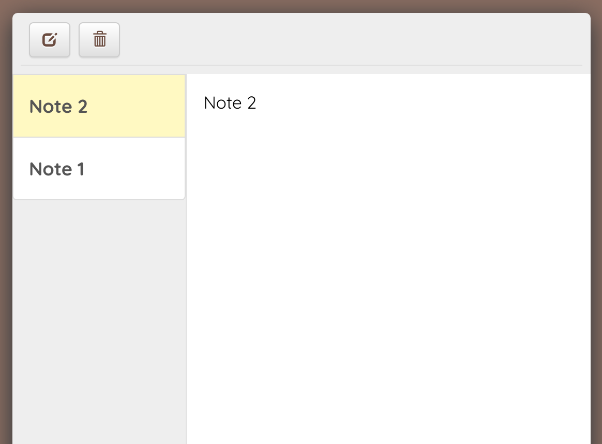
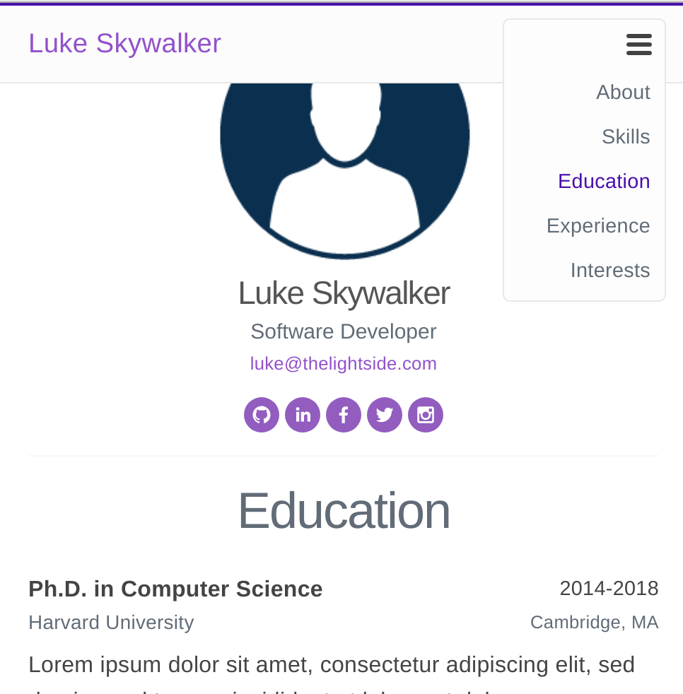
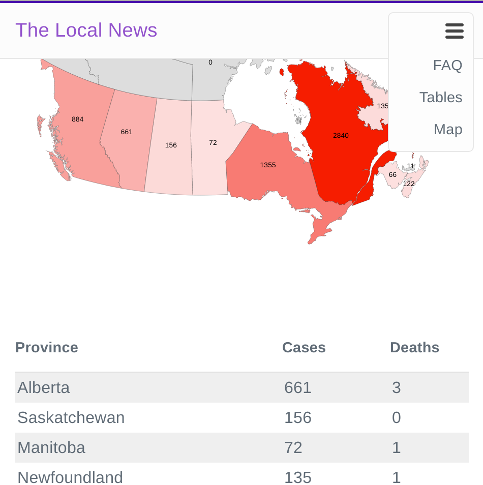
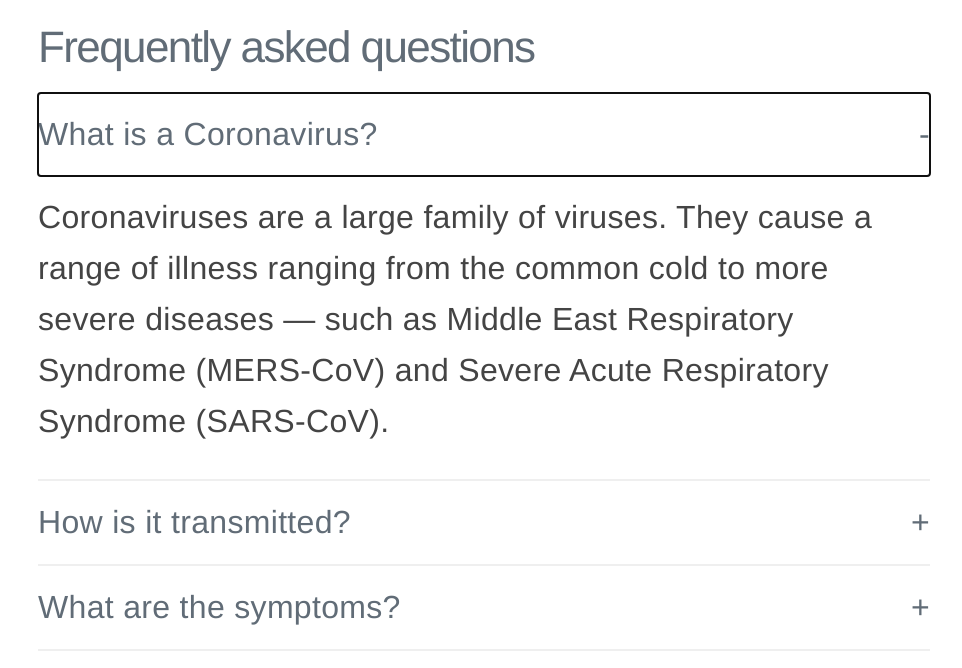
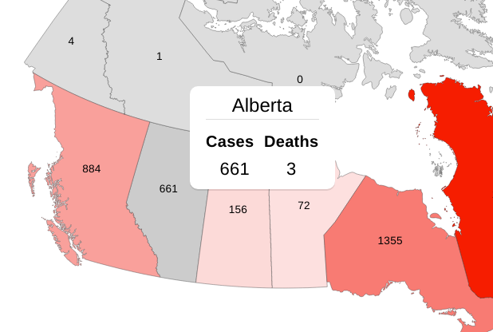
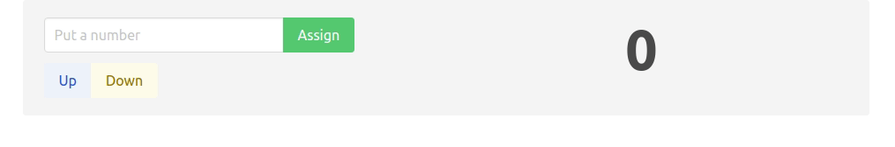

# React & REST Assignments

## Notepad
 

    

 
 

#### Requirements
- This is a single-page application, however, for better user experience, a router must be used. You can use [React Router](https://reactrouter.com/) or [Reach Router](https://reach.tech/router/) for this. 

- Each note must have a dedicated route. For instance, `mynotepadapp.com/note1`. You can have your own routing policy.

- The design must be responsive and displays well on various screen resolutions. It is recommended to use a CSS framework like [Bulma](https://bulma.io), but it's finally your decision.

- The application must have a backend with a database. The database type and engine is your choice. You can choose a relational or NoSQL database. The backend language is also not important.

- It's important that the application uses REST API for talking to the backend. As mentioned before, the language and framework you're chooing for your backend is not important as long as your API endpoints work correctly. Make sure to use the correct REST verb for your operations: `PUT`, `GET`, `DELETE`, etc.

- You don't need to use Redux for this application. Redux is considered an old approach right now. React has become so powerful in managing states that using Redux is rarely considered today. 

- For a bonus mark, you can implement Markdown support for your notes. This is not a difficult thing to do, especially if you use a library. There are a number of React libraries that will do the job for you; [`react-markdown`](https://github.com/remarkjs/react-markdown) is one of them.

## Online Resume
 

    

 
 

#### Requirements
- In this assignment, you will build an online resume using React.

- It's important for the design to be responsive. It's recommended to use a CSS framework for this, but that's your choice. In case you're wondering, the above design is using [Milligram CSS](https://milligram.io/).

- You have two options here: you can use a router (as mentioned in the previous assignment), or you can use a React framework for static websites, such as [Gatsby](https://gatsbyjs.org). The above design is using Gatsby.

- It's important that each page gets its own URL. This is easy if you use Gatsby, as you will create a separate `js` file for each page. If you're using a React router, depending on the library, the process could be different.

- Although the application doesn't receive any input from users, it's important to use REST APIs for fetching data from the back-end. If you're using Gatsby, it comes with `graphql` support, so you can take advantage of that.

- It's not important which kind of database you're using in the backend (relational or NoSQL), but a NoSQL database like MongoDB makes sense here, as there is no need for advanced inter-table queries. 

- For a bonus mark, you could implement different themes for the application. Each theme will have its own color scheme. If you're using Gatsby, the theme configuration could be in the `gatsby-config.js` file. You don't need to put the theme in your database.

## Canada Pandemic Tracker

 

    

 
 
 

    

 
 
 

    

 
 

#### Requirements
- In this assignment, you'll be building a tracking page for pandemics in Canada.

- It's important that design will be responsive. It's recommended to use a CSS framework, but it's not mandatory. The above design uses [Milligram](https://milligram.io/).

- The above design uses [D3.js](https://d3js.org/) which is a JavaScript library for creating maps, plots, charts, etc. The map is actually a `json` file containing all the necessary information for the `D3` library to render that map. So, you don't have to draw it yourself!

- Making `D3` to work with React could be a little tricky, as `D3` was introduced years before React existed. As such, it doesn't have React support right out of the box. However, it's something that a lot of people have done. You can find examples on the Internet. The above design uses `D3` and React.

- Although the map can be drawn from the `json` file I mentioned earlier, it is your responsibity to style it. For instance, as it shows in the above screenshot, the color of each province is determined based on the number of confirmed cases, so it's a dynamic strategy. You need to color each province in run-time, after you have obtained the number of confirmed cases.

- Another thing that doesn't come with `D3` is the pop-up feature shown in the last figure. That is not a `D3` thing, it's pure React and CSS. You need to build this functionality into the application.

- Although the above application is using `D3` for the map, you don't have to use the exact same library. You can do your own research and choose a different library. Just keep in mind that the final application needs to have been built by React. You can't choose a library for the map that does not require any React code. It's mandatory to use React to control the state of your application. 

- For fetching the data, you can use free APIs on the Internet. You can also mock an API yourself with a dummy back-end. There are also free files provided by agencies such as the [Government of Canada](https://www.canada.ca/en/public-health/services/diseases/2019-novel-coronavirus-infection.html) that will help you gather the latest information. The link provided is for the Coronavirus pandemic. 

- You can't just point your application to read a file from another website. Remember CORS? Well, that's the problem. Unless they let you do it (highly unlikely when it comes to government websites), browsers won't let you do the request. What you can do, however, is to build a pipeline where you download the file once every hour and put it on your own domain, then have your API to read from that file. Since in this scenario you're reading from your own domain, there would be no problem. That might be a little out of scope of this course, but it's not something super difficult. For a bonus point, you could implement this feature.

- No matter what library you're choosing to draw the map, read the documentation carefully to see what file types the library supports. For instance, some libraries might only work with `json` whereas others might also support `csv`. The `D3` library work very well with both file types. The above design, by the way, uses a `csv` file. 

## Counter

#### Requirements
- In this project, you will build a simple Counter application with React. 

- The gif above shows how the app should work. There are two buttons: Up and Down, which increments and decrements the counter value, respectively. 

- There is also a text input where you can put a number and assign it to the counter. To assign a new value, you can either press Enter when the input box is focused, or click on the Assign button.

- You can design your own user interface, and it doesn't have to be like the design shown here.
